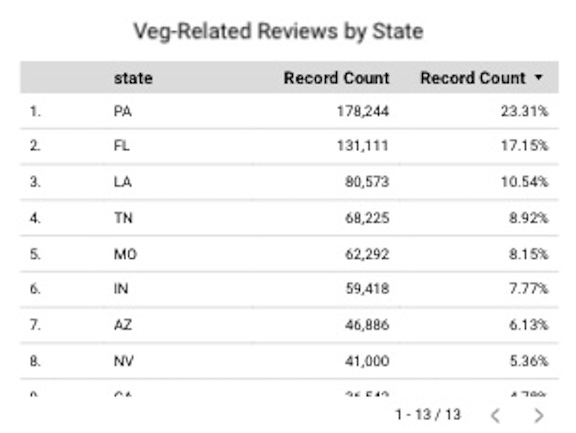

# Data Engineering Project - Yelp Word Analysis
## *Is demand for veg-friendly restaurant food increasing over time?*

---
## Background
2023 Stats on Vegans and Vegetarians:
- 4% of U.S. adults identify as vegetarian
- 1% of U.S. adults identify as vegan
- These percentages have remained fairly consistent over the past decades

Source: https://news.gallup.com/poll/510038/identify-vegetarian-vegan.aspx

---
## The Question
Because the percentage of US adults identifying as vegetarian or vegan has remained fairly constant over time, does this mean that demand for plant-based options at restaurants has also been holding constant?  This project analyzes the words used in Yelp reviews from 2012-2021 to see the trend in demand for veggie options.

---
## The Yelp Data Set
- 64,600 businesses in the food and restaurant category
- 5.1 million associated reviews
- States included: Pennsylvania, Tennessee, Missouri, Florida, Indiana, Nevada, Illinois, Arizona, New Jersey, California, Delaware, and Idaho (12 in total)

---
## Project Architecture

Exploratory data analysis was performed in Jupyter Notebook.  The Yelp dataset consists of two json files, one with business data and the other with review data.

Decisions had to be made around which data to include and exclude, what data types would need to be updated, and how to join the data sets together.

## Data Orchestration
Transformation:
- cleansing of the review text: all special characters were removed and converted to lower case to prepare for matching
- removal of records where the business was not a US state
- converting data types, changing field names

Matching:
One of the most time consuming tasks was counting the number of veg-related words or phrases that appeared in each of more than 5 million reviews.  This task was accomplished by using a library called Pandarallel which allowed for multiprocessing.  The pandarallel optimized matching process ran in less than 8 minutes (vs 46 minutes when running without multiprocessing), cutting the processing time by almost a factor of 6.

## Google Cloud Storage and BigQuery
Writing the cleansed data to a bucket in GCP posted an unexpected challenge.  The first attempt consisted of writing all the data to one large parquet file.  This solution had to be re-worked because the BigQuery table that was derived from the data would throw memory errors every time it was accessed.  To solve this, the data was written to 4 parquet files of equal record length.  The resulting BigQuery table was then able to be accessed as expected.

## Data Visualization and Analysis
### Overview
- Reviews from 2012-2022
- Reviews for businesses in states with fewer than 100 reviews were excluded, 13 total states
- 4.6 million reviews
- 764,574 reviews had at least one vegetable related word or phrase included (almost 16.5%)

### 2021 Matched Words Word Cloud:

### Veg-Related Words Trend over Time

The data shows that the percentage of veg-related reviews were increasing over time until Covid hit in 2020.  We see a growth from 4.6% to 14% in 2018 and 2019.  In 2020 the percentage dropped to 8.4% and in 2021 it only recovered slightly to 9.6%, right between the 2014 and 2015 percentages.  It would be interesting to look at more recent data to see if percentages post-Covid have moved back to their pre-pandemic levels. 

### State Breakdown

Recalling that we only have 13 of the 50 states here, this chart ranks them by the percentage of total records descending.  The state with the highest veg-related percentage of reviews is Pennsylvania at 23.31%.  Florida is more than 6% behind at 17.15%, followed by Louisiana at 10.54%.

### Star Breakdown

These charts reveal that the majority of veg-related reviews were 5 star reviews.  Individuals seeking vegetarian and vegan food are happy when there are options available for them to eat at a given restaurant - I can attest to this from personal experience!